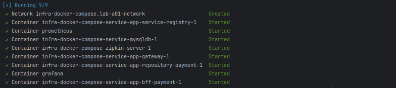
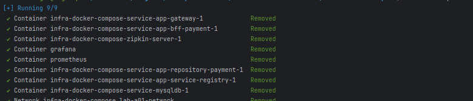

# Infraestrutura Spring Cloud com Docker Compose

Exemplo de Infra com Docker Compose

---

## 🚀 Sobre

Esse laboratório de estudo cria uma infra com imagens de aplicativos que rodam containeres
utilizando [Docker](https://www.docker.com/).
e Docker-Compose. A stack de imagens são aplicações distribuídas construidos com Spring Boot
e [Spring Cloud](https://spring.io/cloud).
Essa stack apenas exemplifica a execução de um sistema de pagamentos que utiliza operações CRUD.

### 📋 Pré-requisitos
* Docker e Docker Compose

### 🔧 Instalação

Tem varia maneiras de instalação do docker em seu pc tanto para Windows como [Docker Desktop](https://docs.docker.com/desktop/) 
quanto para Linux como [Docker Engineer](https://docs.docker.com/engine/). Porém a maneira que fiz nesse projeto foi 
utilizar a ferramenta `Snap` da distribuição Linux Ubuntu onde o mesmo ja instala o docker quanto do docker-compose conforme
exemplo abaixo:

```bash
  sudo snap install docker
```

---
## 🖥️ Stack da Docker-Compose

A stack de imagens no [docker-compose](docker-compose.yml) é constituido dos seguintes projetos e imagens:

| Serviço                        | Imagem Docker Hub                                                                                                    | Projeto da Imagem GitHub                                                                         |
|--------------------------------|----------------------------------------------------------------------------------------------------------------------|--------------------------------------------------------------------------------------------------|
| service-app-service-registry   | [williamreges/lab-a01-infra-service-registry](https://hub.docker.com/r/williamreges/lab-a01-infra-service-registry)  | [lab-a01-infra-service-registry](https://github.com/williamreges/lab-a01-infra-service-registry) |
| service-app-repository-payment | [williamreges/lab-a01-app-repository-payment](https://hub.docker.com/r/williamreges/lab-a01-app-repository-payment ) | [lab-a01-app-repository-payment](https://github.com/williamreges/lab-a01-app-repository-payment) |
| service-app-bff-payment        | [williamreges/lab-a01-app-bff-payment](https://hub.docker.com/r/williamreges/lab-a01-app-bff-payment)                | [lab-a01-app-bff-payment](https://github.com/williamreges/lab-a01-app-bff-payment)               |
| service-app-gateway            | [williamreges/lab-a01-app-gateway](https://hub.docker.com/r/williamreges/lab-a01-app-gateway)                        | [lab-a01-app-gateway](https://github.com/williamreges/lab-a01-app-gateway)                       |
| service-mysqldb                | [mysql](https://hub.docker.com/_/mysql)                                                                              | ---                                                                                              |
| Prometheus                     | [prom/prometheus](https://hub.docker.com/r/prom/prometheus)                                                          | ---                                                                                              |
| Grafana                        | [grafana/grafana](https://hub.docker.com/r/grafana/grafana)                                                          | ---                                                                                              |
| Zipkin                         | [openzipkin/zipkin](https://hub.docker.com/r/openzipkin/zipkin)                                                      | ---                                                                                              |

---

## ⚙️ Executando Ambiente


Execute o seguinte comando no arquivo [docker-compose.yml](docker-compose.yml) dentro da pasta do arquivo:**

1. **Rode o ambiente**
```bash
  docker compose up -d
```
Será mostrado logs parecido como demonstrado abaixo mostrando que o docker compose executou as imagens com sucesso:



2. **Veja os Logs**

Para ver os logs do ambiente via console tem duas maneiras:

* Todos os logs em tempo real com o comando:
```bash
  docker compose logs --follow
```

* logs em tempo real específico de um serviço com o comando:
```bash
  docker compose logs --follow service-app-repository-payment
```

3. **Parando os Serviços**

Para parar os serviços existe algumas formas:

* Todods os serviços da stack serão parados e seus recursos como containeres, imagens, volumes e networks
serão removidos com o comando:
```bash
  docker compose down
```
Será mostrado logs parecido como demonstrado abaixo mostrando que o docker compose executou as imagens com sucesso:


