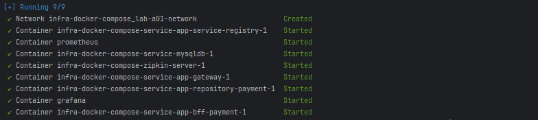
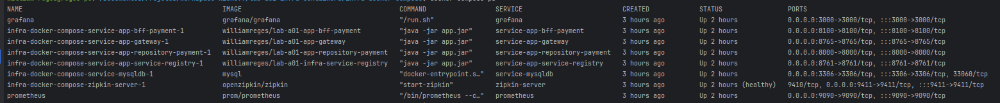
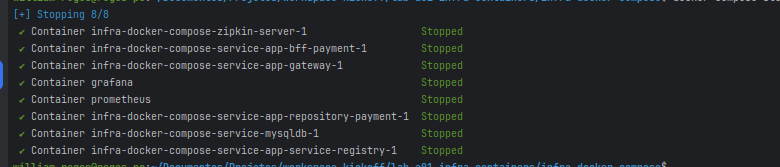
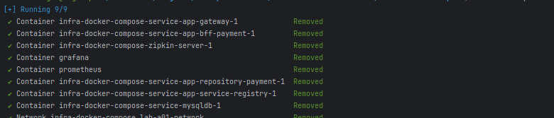
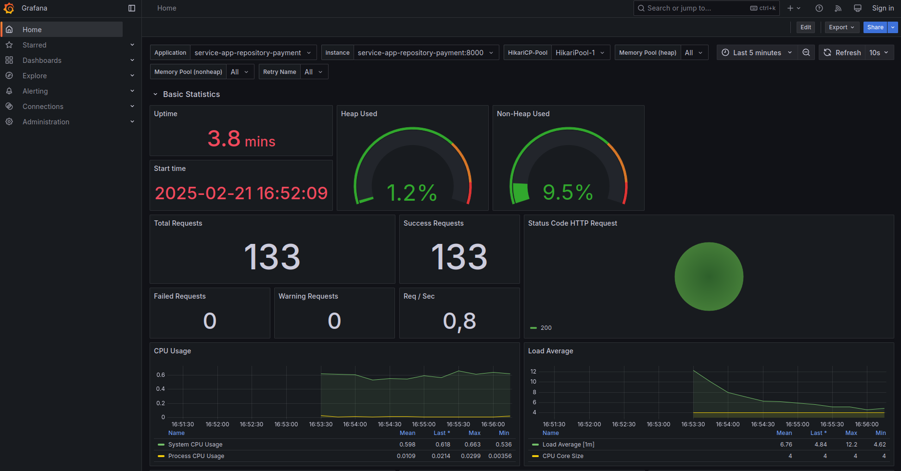
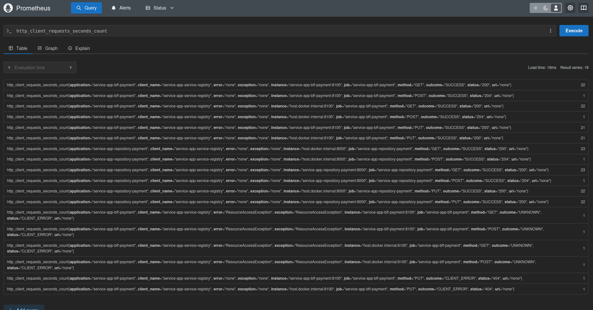
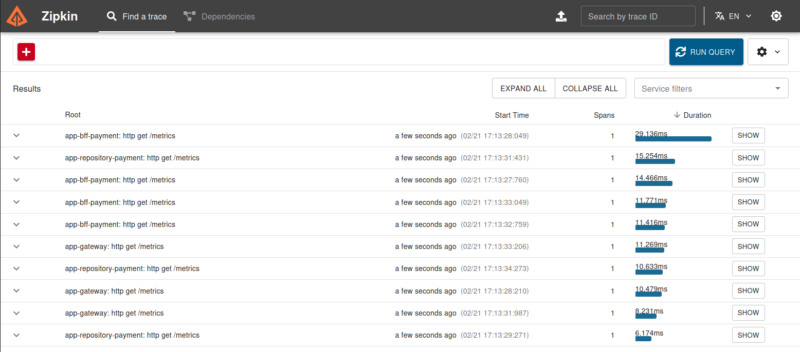

# Aplicações Spring Cloud com Docker Compose

Exemplo de Infra com Docker Compose

---

## 🚀 Sobre

Esse laboratório de estudo cria uma infra com imagens de aplicativos que rodam containeres
utilizando [Docker](https://www.docker.com/).
e Docker-Compose. A stack de imagens são aplicações distribuídas construidos com Spring Boot
e [Spring Cloud](https://spring.io/cloud).
Essa stack apenas exemplifica a execução de um sistema de pagamentos que utiliza operações CRUD.

### 📋 Pré-requisitos

* Docker e Docker Compose

### 🔧 Instalação

Tem varia maneiras de instalação do docker em seu pc tanto para Windows
como [Docker Desktop](https://docs.docker.com/desktop/)
quanto para Linux como [Docker Engineer](https://docs.docker.com/engine/). Porém a maneira que fiz nesse projeto foi
utilizar a ferramenta `Snap` da distribuição Linux Ubuntu onde o mesmo ja instala o docker quanto do docker-compose
conforme
exemplo abaixo:

```bash
  sudo snap install docker
```

---

## 🖥️ Stack da Docker-Compose

A stack de imagens no [docker-compose](docker-compose.yml) é constituido dos seguintes projetos e imagens:

| Serviço                        | Imagem Docker Hub                                                                                                    | Projeto da Imagem GitHub                                                                         |
|--------------------------------|----------------------------------------------------------------------------------------------------------------------|--------------------------------------------------------------------------------------------------|
| service-app-service-registry   | [williamreges/lab-a01-infra-service-registry](https://hub.docker.com/r/williamreges/lab-a01-infra-service-registry)  | [lab-a01-infra-service-registry](https://github.com/williamreges/lab-a01-infra-service-registry) |
| service-app-repository-payment | [williamreges/lab-a01-app-repository-payment](https://hub.docker.com/r/williamreges/lab-a01-app-repository-payment ) | [lab-a01-app-repository-payment](https://github.com/williamreges/lab-a01-app-repository-payment) |
| service-app-bff-payment        | [williamreges/lab-a01-app-bff-payment](https://hub.docker.com/r/williamreges/lab-a01-app-bff-payment)                | [lab-a01-app-bff-payment](https://github.com/williamreges/lab-a01-app-bff-payment)               |
| service-app-gateway            | [williamreges/lab-a01-app-gateway](https://hub.docker.com/r/williamreges/lab-a01-app-gateway)                        | [lab-a01-app-gateway](https://github.com/williamreges/lab-a01-app-gateway)                       |
| service-mysqldb                | [mysql](https://hub.docker.com/_/mysql)                                                                              | ---                                                                                              |
| Prometheus                     | [prom/prometheus](https://hub.docker.com/r/prom/prometheus)                                                          | ---                                                                                              |
| Grafana                        | [grafana/grafana](https://hub.docker.com/r/grafana/grafana)                                                          | ---                                                                                              |
| Zipkin                         | [openzipkin/zipkin](https://hub.docker.com/r/openzipkin/zipkin)                                                      | ---                                                                                              |

---

## ⚙️ Executando Ambiente

### Rode o ambiente

Faça clone do projeto:

```bash
  git clone https://github.com/williamreges/lab-a01-infra-containers.git
```

Execute o seguinte comando no arquivo [docker-compose.yml](docker-compose.yml) dentro da pasta do arquivo:

```bash
  docker compose up -d
```

Será mostrado logs parecido como demonstrado abaixo mostrando que o docker compose executou as imagens com sucesso:



Já o comando ```docker compose ps``` mostra todos os containers rodando:



### Veja os Logs

Para ver os logs do ambiente via console tem duas maneiras:

* Todos os logs em tempo real com o comando:

```bash
  docker compose logs --follow
```

* logs em tempo real específico de um serviço com o comando:

```bash
  docker compose logs --follow service-app-repository-payment
```

### Stopped e Removed

Para parar os serviços existe algumas formas:

* Todos os serviços da Stack estarão `Stopped`. Ou seja, mantem os containeres apenas parados com o comando:

```bash
  docker compose stop
```

Será mostrado logs parecido como demonstrado abaixo mostrando que o docker compose executou o comando com sucesso:


* Todods os serviços da stack estarão como `Removed`. Ou seja, seus recursos como containeres, imagens, volumes e
  networks
  serão removidos com o comando:

```bash
  docker compose down
```

Será mostrado logs parecido como demonstrado abaixo mostrando que o docker compose executou o comando com sucesso:



---

## ⌨️ Executando os testes

Para testar as operações CRUD na aplicação vamos utilizar chamadas REST nos endpoints. Aqui nesse teste iremos chamar os
endpoints do Gateway `service-app-gateway` que por sua vez irá fazer requisições em cascata tudo integrado com
os recursos do Spring Cloud dentro do docker-compose. Exemplo:

***service-app-gateway -> service-app-bff-payment -> service-app-repository-payment -> mysql***.

> **Observacão:**
>
> Se desejar testar suas requisições via Postaman ou Insomnia importe as collections que estão em
> [doc/collections](./doc/collections)
>

### Testando Gateway

Execute o seguinte comando:

```bash
  curl -request GET --url http://localhost:8765/get
```

Se retorna algum json como no exemplo abaixo significa que o Gateway está pronto para receber requisições REST.

```json
{
  "args": {},
  "headers": {
    "Accept": "*/*",
    "Content-Length": "0",
    "Forwarded": "proto=http;host=\"localhost:8765\";for=\"172.18.0.1:37268\"",
    "Hello": "World",
    "Host": "httpbin.org",
    "Range": "bytes=equest",
    "Traceparent": "00-67b8f5849d4e502f4c151cad5f6e64f4-9170105b4373be32-01",
    "User-Agent": "curl/8.5.0",
    "X-Amzn-Trace-Id": "Root=1-67b8f585-57692a3c645f84ea0bc4d09c",
    "X-Forwarded-Host": "localhost:8765"
  },
  "origin": "172.18.0.1, 191.178.195.171",
  "url": "http://localhost:8765/get"
}
```

### POST - Gerar Pagamento PIX

Para testar uma requisição de operação de pagamento via PIX através do Gateway execute a seguinte requisição:

```bash
  curl --request POST \
  --url http://localhost:8765/transacao-pix \
  --header 'Content-Type: application/json' \
  --header 'User-Agent: insomnia/10.3.0' \
  --data '{
	"codigoPessoa": "fbc5fbc7-9b55-4058-af41-fa94ae092ae8",
	"valorTrancacao": 2500.50,
	"dataTrancacao": "2025-02-03T13:00:00",
	"codigoBeneficiario": "02d807e5-dd29-4a25-9de7-a621209c28b7",
	"mensagemTransacao":" PIX para compra de carro"
}'
```

Será retornado um hash que simula o `ID da Transação` feito com exito. Exemplo: `9c96dc20-a2de-4b12-b651-e2ed8c82737b`

### GET - Obtem um Pagamento PIX por ID da Transação

Com o hash obtido podemos obter o registro do PIX feito anteriormente conforme exemplo abaixo.

```bash
curl --request GET \
--url http://localhost:8765/transacao-pix/9c96dc20-a2de-4b12-b651-e2ed8c82737b \
--header 'User-Agent: insomnia/10.3.0'
```

E com isso logo será retornado algo parecido com esse body abaixo:

```json
{
  "codigoTrancacao": "9c96dc20-a2de-4b12-b651-e2ed8c82737b",
  "codigoPessoa": "fbc5fbc7-9b55-4058-af41-fa94ae092ae8",
  "valorTrancacao": 2500.5,
  "dataTrancacao": "2025-02-03T13:00:00",
  "codigoBeneficiario": "02d807e5-dd29-4a25-9de7-a621209c28b7",
  "mensagemTransacao": " PIX para compra de carro"
}
```

### PUT - Atualiza um Pagamento PIX por ID da Transação

Embora não exista como atualizar uma transação, mas como fim de estudo inseri esse recurso nesse projeto. Execute a
seguinte
requisição abaixo editando qualquer atributo. Nesse exemplo mudei a `mensagemTransacao` e `valorTrancacao`:

```bash
curl --request PUT \
  --url http://localhost:8765/transacao-pix/9c96dc20-a2de-4b12-b651-e2ed8c82737b \
  --header 'Content-Type: application/json' \
  --data '{
   "codigoPessoa":"fbc5fbc7-9b55-4058-af41-fa94ae092ae8",
   "valorTrancacao":1000.00,
   "dataTrancacao":"2025-02-03T13:00:00",
   "codigoBeneficiario":"02d807e5-dd29-4a25-9de7-a621209c28b7",
   "mensagemTransacao":" PIX para compra de uma moto"
}'
```

Será retorna status 200. Execute o GET com esse mesmo `ID da Transação` para obter o registro atualizado.
Execute a seguinte requisição abaixo:

### DELETE - Remova uma Pagamento PIX por ID da Transação

Embora não exista como atualizar uma transação, mas como fim de estudo inseri esse recurso nesse projeto.

```bash
curl --request DELETE \
  --url http://localhost:8765/transacao-pix/9c96dc20-a2de-4b12-b651-e2ed8c82737b \
  --header 'User-Agent: insomnia/10.3.0'
```

## 📈 Abrindo as Ferramentas no Browser

As ferramentas como Grafana, Zikping e Eureka podem ser abertos pelo browser depois que o docker compose estiver em
execução

1. Acesse o Grafana e acompanhe as métricas que a ferramenta obtitem do Prometheus pelo link http://localhost:3000



2. Acesse o Prometheus pelo link http://localhost:9090 e veja as métricas que o prometheus obtém das aplicações
   através de scraps:



3. Acesse o Zikping pelo link http://localhost:9411 para ver o tracking das chamadas

l

